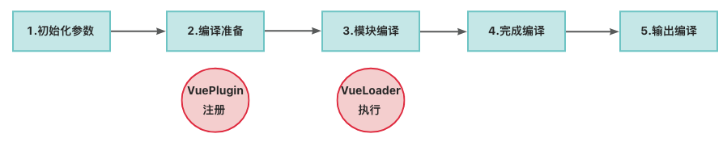
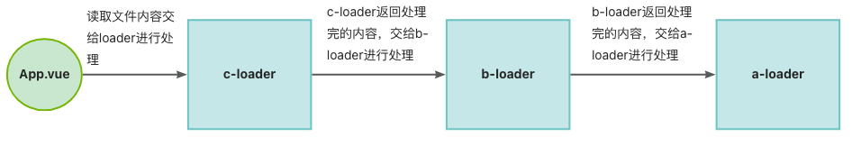
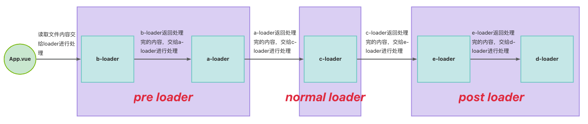

Vue2编译原理 && Vue-loader编译原理


# 一、Vue项目开发模式

Vue除了runtime-only模式外，还有runtime-compiler模式。

## 1.1 Runtime-Only模式

平时我们开发项目基本都采用这种模式。在这种模式下，Vue在构建时将模板预先编译成渲染函数，因此最终的打包产物不包含模板编译器。这意味着在运行时，Vue实例需要接收一个已经预编译好的渲染函数，通常这个过程在使用如webpack + vue-loader时自动完成。由于不需要包含编译器，此模式生成的代码体积更小，加载更快。

所以在这个模式下流程大致是：webpack+vue-loader在代码构建阶段将.vue模版中的内容转化成一个render函数。

## 1.2 Runtime+Compiler模式

与Runtime-Only相比，runtime+compiler 模式包含了模板编译器，它允许Vue在运行时动态地编译模板。这意味着你可以在客户端即刻读取与编译模板字符串，这对于一些特定的应用场景（比如使用Vue来动态渲染用户输入的模板）非常有用。但这种方式会导致最终打包的文件体积更大，因为包含了编译器的代码。

所以在这个模式下流程大致是：不借助webpack，通过Vue内置编译器将template中的内容或者dom节点转化成render函数。

在Vue 2中，这两个模式的选择通常是通过如何引入Vue库以及构建配置来区分的。而在Vue 3中，默认推荐使用runtime-only模式，并且鼓励开发者使用.vue单文件组件，其中的模板会在构建时被预编译。如果需要在Vue 3中使用类似runtime+compiler的功能，可能需要额外配置或寻找替代方案，因为Vue 3的核心库默认不再包含完整的编译器。


# 二、Vue 的 Runtime+Compiler模式

我们先来研究一下Vue中的Runtime + Compiler模式，因为这个模式中包含了完整的编译相关的代码。

## 2.1 直接使用HTML来编写Vue项目

当你只想写一个简单的页面，不想使用脚手架来建一个比较庞大的项目时，你可以直接创建一个html文件。
只需要引入全量的Vue包，即包含了Runtime和Compiler的包。就可以进行开发，这一点还是比较方便的。

```js
<!DOCTYPE html>
<html>
    <head>
        <script src="https://cdn.jsdelivr.net/npm/vue@2.7.16/dist/vue.js"></script>
    </head>
    <body>
        <div id="container">
            Hello, {{ name }}
        </div>
        <script>
            new Vue({
                el:"#container",
                data(){
                    return {
                        name:"Vue2"
                    }
                }
            })
        </script>
    </body>
</html>
```

## 2.2 Vue Compiler编译的大致流程

1. 在内部获取到模版对应的字符串
2. 调用 compilerHTMLStringToAST 函数将

## 2.3 编译入口

Runtime代码打包入口位于```src/platforms/web/runtime/index.ts```中。

而Rutime+Compiler代码打包入口位于```src/platforms/web/entry-runtime-with-compiler-es.ts```中。

```js
import Vue from './runtime/index'
const mount = Vue.prototype.$mount
Vue.prototype.$mount = function (
  el?: string | Element,
  hydrating?: boolean
): Component {
  el = el && query(el)

  /* istanbul ignore if */
  if (el === document.body || el === document.documentElement) {
    __DEV__ &&
      warn(
        `Do not mount Vue to <html> or <body> - mount to normal elements instead.`
      )
    return this
  }

  const options = this.$options
  // resolve template/el and convert to render function
  if (!options.render) {
    let template = options.template
    if (template) {
      if (typeof template === 'string') {
        if (template.charAt(0) === '#') {
          template = idToTemplate(template)
          /* istanbul ignore if */
          if (__DEV__ && !template) {
            warn(
              `Template element not found or is empty: ${options.template}`,
              this
            )
          }
        }
      } else if (template.nodeType) {
        template = template.innerHTML
      } else {
        if (__DEV__) {
          warn('invalid template option:' + template, this)
        }
        return this
      }
    } else if (el) {
      // @ts-expect-error
      template = getOuterHTML(el)
    }
    if (template) {
      /* istanbul ignore if */
      if (__DEV__ && config.performance && mark) {
        mark('compile')
      }

      const { render, staticRenderFns } = compileToFunctions(
        template,
        {
          outputSourceRange: __DEV__,
          shouldDecodeNewlines,
          shouldDecodeNewlinesForHref,
          delimiters: options.delimiters,
          comments: options.comments
        },
        this
      )
      options.render = render
      options.staticRenderFns = staticRenderFns

      /* istanbul ignore if */
      if (__DEV__ && config.performance && mark) {
        mark('compile end')
        measure(`vue ${this._name} compile`, 'compile', 'compile end')
      }
    }
  }
  return mount.call(this, el, hydrating)
} 
```


# 三、vue-loader编译原理

此前，我们把 template 当作选项传递至 Vue 实例里，Vue 内部会将模板字符串转化为渲染函数，并将其挂载在 Vue 实例的 render 方法上，以便在后续运行时，Vue 能够对其加以渲染。

然而，在我们日常的开发过程中，常常会采用单文件组件（SFC）的开发模式。简而言之，一个 .vue 文件就相当于一个独立的组件，它对组件的 HTML 模板、CSS 样式以及 JS 逻辑进行了封装。也就是我们频繁使用的 .vue 文件，一般来说，.vue 文件需要依靠第三方的插件或者库来完成编译。以下是常用的关于 .vue 的 Webpack 配置。

```js
const { VueLoaderPlugin } = require('vue-loader');

module.exports = function(){
  module:{
    rules:[
      {
        test: /\.vue$/,
        loader:'vue-loader'
      }
    ]
  },
  plugins:[
    new VueLoaderPlugin()
  ]
}
```

上述配置中的 module 和 plugins 是做什么用的呢？这便是我们在本章需要学习的知识要点。

## 1. webpack的loader和plugin

### 1.1 webpack的编译流程

在 Vue 项目里，浏览器无法识别 .vue 文件，因而需要借助 Webpack（基础框架）以及 vue-loader（Webpack 的扩展插件）来对 Vue 文件予以编译，从而使浏览器能够识别。



1. 初始化参数阶段

在此步骤中，会从我们所配置的 webpack.config.js 里读取到的相应配置参数，和 shell 命令中传递进来的参数加以合并，以获取最终的打包配置参数。

2. 编译准备阶段

在这一步，我们会通过调用 webpack() 方法来返回一个 compiler 方法，以此创建我们的 compiler 对象，同时注册各个 Webpack Plugin。接着找到配置入口中的 entry 代码，调用 compiler.run() 方法来进行编译。

> 我们在webpack.config.js配置的VueLoaderPlugin就是在这里注册

3. 模块编译阶段

从入口模块进行分析，调用与文件相匹配的 loaders 来对文件进行处理。与此同时，分析模块所依赖的其他模块，以递归的方式开展模块编译工作。

> 我们在webpack.config.js配置的rules中的vue-loader就是在这里解析

4. 完成编译阶段

在递归完成后，每个被引用的模块都经由 loaders 处理完毕，同时也获取到了模块之间的相互依赖关系。

5. 输出文件阶段

整理模块的依赖关系，同时把处理后的文件输出至 output 所指定的磁盘目录当中。

### 1.2 webpack的loader

#### 1.2.1 为什么会存在loader

Webpack 仅能够处理 .js 和 .json 文件，然而在打包的过程中倘若遇到其他类型的文件，例如 .vue 文件等等，Webpack 就显得力不从心了。

Loader 的出现，使得 Webpack 具备了处理其他类型文件的能力。

如下配置常用来+解析less文件。

```js
module.exports = {
    // ...
    module: {
        rules: [
            {
                test: /.less$/i, // 匹配.less结尾的文件
                use: [
                    "style-loader",
                    "css-loader",
                    'less-loader'
                ],
            }
        ],
    }
    // ...
};
```

```js
//js文件
import "./style.less";
```

在 JavaScript 代码中，使用 import 导入了一个 .less 文件，当 Webpack 碰到这种 .less 后缀的文件时，就茫然无措了，因为它只能处理以 .js 和 .json 结尾的文件。

这时候就轮到 loader 登场了，有了 loader 所赋予的能力，Webpack 便能够处理 .less 文件了。

1. 在 Webpack 的模块编译阶段，一旦遇到以 .less 后缀结尾的文件，Webpack 会先把文件内容发送给 less-loader 进行处理，less-loader 会将所有的 Less 语法转换为普通的 CSS 语法。
2. 普通的 CSS 样式会继续被发送给 css-loader 处理，css-loader 最主要的功能在于解析 CSS 语法中的 @import 和图片路径，处理完成后，导入的 CSS 被合并在了一起。
3. 合并后的 CSS 文件会继续传递下去，被发送给 style-loader 进行处理，它最终会将样式内容插入到 HTML 头部的 ```<style>``` 标签下，页面也由此添加了样式。

从上述的案例当中我们能够看出，每个 loader 的职责都是单一的，各自只负责自身的那一小部分。但不管是何种格式的文件，只要将具备特定功能的 loader 组合起来，就能够增强 Webpack 的能力，让各种各样稀奇古怪的文件都能够被正确地识别并处理。

#### 1.2.2 什么是loader

Loader 实际上就是一个内容转换工具，它能够把 Webpack 无法识别的文件，转换为标准的 JavaScript 模块，然后交由 Webpack 进行处理。

Loader 的本质是一个导出了一个函数的 JavaScript 模块，这也恰好体现了在 Webpack 中“一切皆模块”的理念。

Webpack 内部的 loader runner 会调用这个函数，并且将上一个 loader 所产生的结果或者资源文件传入其中。函数中的 this 作为上下文会由 Webpack 进行填充。

```js
/**
 * @param {string/Buffer} content源文件的内容
 * @param {object}[map] sourcemap相关的数据
 * @param {any} [meta] 元数据，可以是任何内容
 */
module.exports = function (content, map, meta) {
    // 将webpack不能识别的文件内容content，转换处理后，进行返回
    return content
} 
```
 
#### 1.2.3 loader的分类

在 Webpack 中，loader 可以被分为 4 类，分别是：

1. pre 前置 loader
2. normal 普通 loader
3. inline 内联 loader
4. post 后置 loader

##### 1.2.3.1 非内联类型loader

pre 和 post loader，可以通过 rule 对象的 enforce 属性来指定，不指定时，默认为normal loader。

```js
module.exports = {
  ...
  module:{
        rules:[
            {
              test: /\.vue$/,
              use: [
                {
                    loader: path.resolve(__dirname, 'babel/one'),
                },
                {
                    loader: path.resolve(__dirname, 'babel/two'),
                },
                {
                    loader: path.resolve(__dirname, 'babel/three'),
                }
              ],
              enforce: "pre", // pre loader
            }, 
            {
              test: /\.vue$/,
              use: [{
                loader: path.resolve(__dirname, 'babel/two'), //normal loader
              }],
            }, 
            {
              test: /\.vue$/,
              use: [{
                loader: path.resolve(__dirname, 'babel/three'),
              }],
              enforce: "post", // post loader
            }
          ]
  }
  ...
} 
```

##### 1.2.3.2 内联类型loader

webpack允许在引入模块的时候直接指定loader，这样指定loader的方式称之为inline loader

```js
import common from 'loader-a!loader-b!loader-c?type=abc!./common.js'
```

每个loader之前同!隔开，允许携带query参数，最后的模块也使用!隔开。

内联的 inline loader 不在webpack的配置文件中配置，它仅在业务代码中配置且使用不多。

#### 1.2.4 loader的执行顺序

相同的优先级指的是同一种类型（```pre  / post  / normal ```）的loader。

##### 1.2.4.1 相同优先级

对于具有相同优先级的 loader 而言，其执行顺序是```从右到左，从下到上```来执行每个 loader 。

所以对于下面的这个配置来说，loader的执行顺序是```c-loader => b-loader => a-loader```



```js
module.exports = { 
  ...
  module:{
        rules:[
            {
              test: /\.vue$/,
              use: [
                {
                  loader: path.resolve(__dirname, 'babel/a'),
                }
              ]
            }, 
            {
              test: /\.vue$/,
              use: [
                {
                  loader: path.resolve(__dirname, 'babel/b'),
                }
              ]
            },  
            {
              test: /\.vue$/,
              use: [
                {
                  loader: path.resolve(__dirname, 'babel/c'),
                }
              ]
            }
        ]
  },
  ...
}
```

##### 1.2.4.2 不同优先级

对于不同优先级来说，```pre（前置）``` => ```normal（普通）``` => ```inline（内联）``` => ```post（后置）```

所以对于下面的这个配置来说，loader的执行顺序是 ```loader-b``` =>```loader-a``` => ```loader-c``` => ```loader-e``` => ```loader-d```



```js
module.exports = {
  module:{
    rules:[
      {
        test: /\.vue$/,
        use: [
          {
            loader: path.resolve(__dirname, 'babel/a'),
          }
        ],
        enforce:"pre"
      }, 
      {
        test: /\.vue$/,
        use: [
          {
            loader: path.resolve(__dirname, 'babel/b'),
          }
        ],
        enforce:"pre"
      }, 
      {
        test: /\.vue$/,
        use: [
          {
            loader: path.resolve(__dirname, 'babel/c'),
          }
        ],
      }, 
      {
        test: /\.vue$/,
        use: [
          {
            loader: path.resolve(__dirname, 'babel/d'),
          }
        ],
        enforce:"post"
      }, 
      {
        test: /\.vue$/,
        use: [
          {
            loader: path.resolve(__dirname, 'babel/e'),
          }
        ],
        enforce:"post"
      }, 
    ]
  }
}
```

##### 1.2.4.3 pitching 阶段